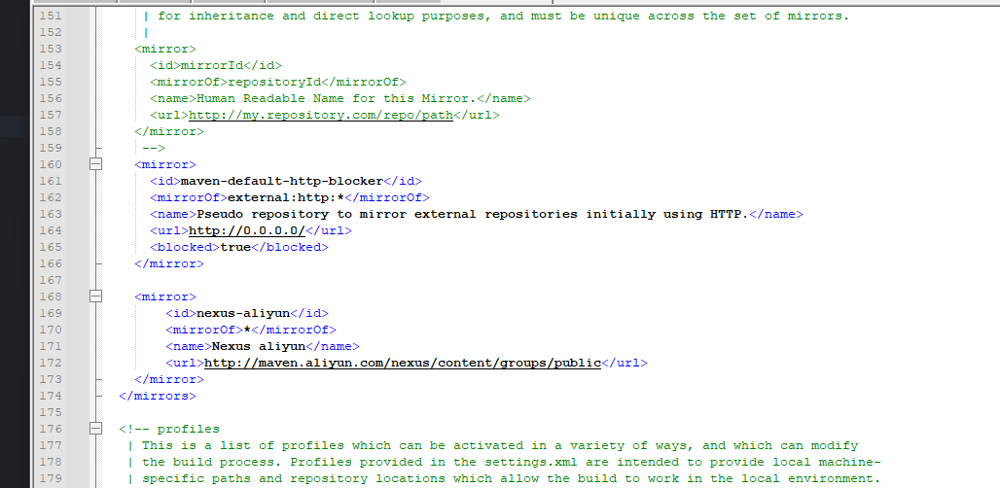
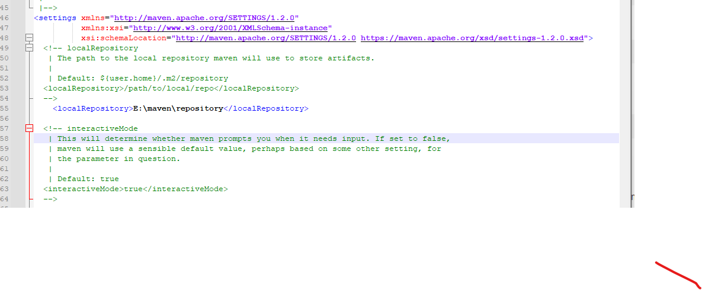
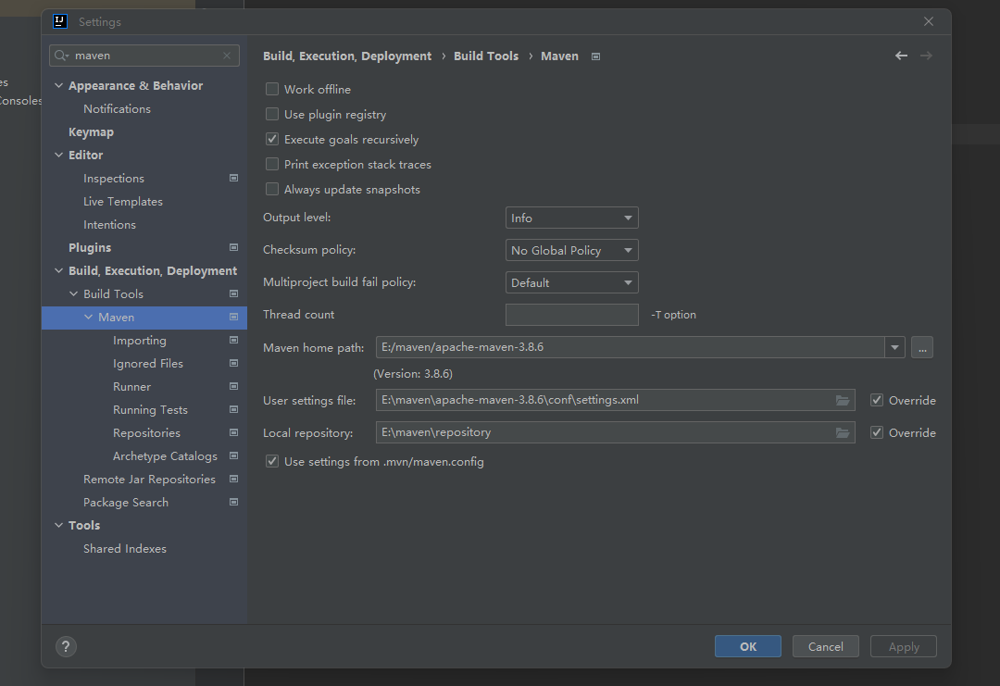

# Maven安装

## 下载
- 官网 https://maven.apache.org/download.cgi

## 环境配置
- 环境变量 -> 系统变量 -> 新建变量
```
变量名：MAVEN_HOME
变量值：Maven安装路径
```

- 环境变量 -> 系统变量 -> Path新建
```
%MAVEN_HOME%\bin
```

## cmd
```
mvn -v
```

## 修改下载镜像
- maven安装目录 -> conf -> setting.xml -> localRepository
- 添加阿里云中央镜像

```
<mirror>
        <id>nexus-aliyun</id>
        <mirrorOf>*</mirrorOf>
        <name>Nexus aliyun</name>
        <url>http://maven.aliyun.com/nexus/content/groups/public</url>
</mirror>
```

## 修改默认maven仓库地址
- maven安装目录 -> conf -> setting.xml -> localRepository
```
 <localRepository>新建仓库地址</localRepository>
```


## 配置idea
